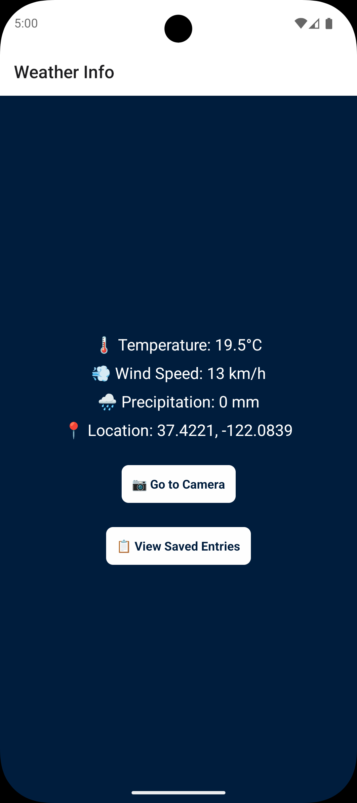
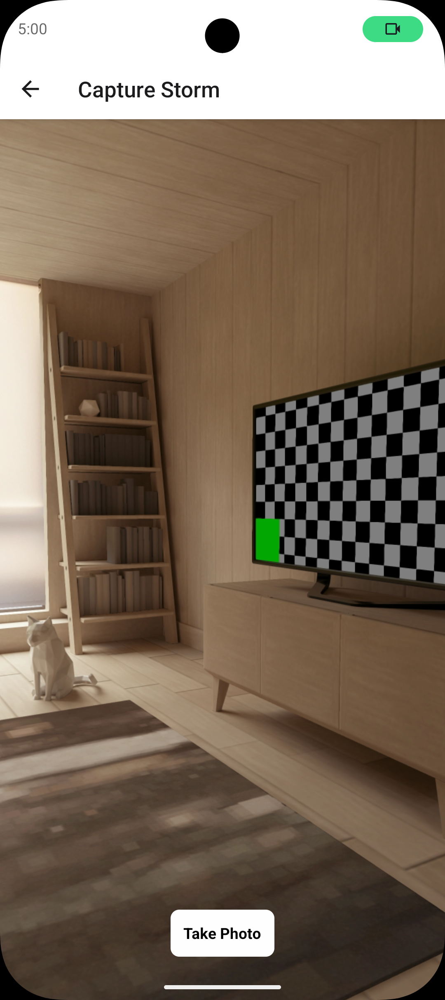
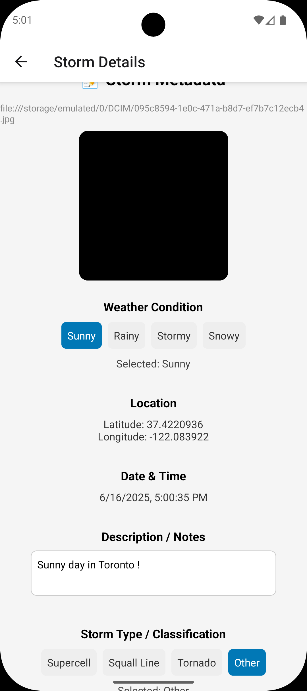
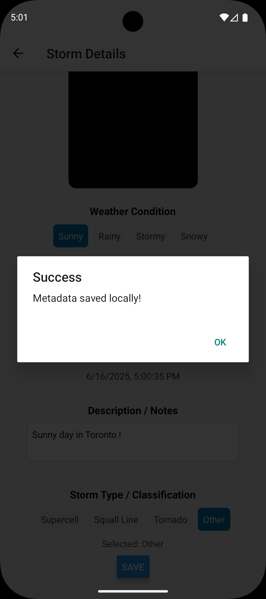
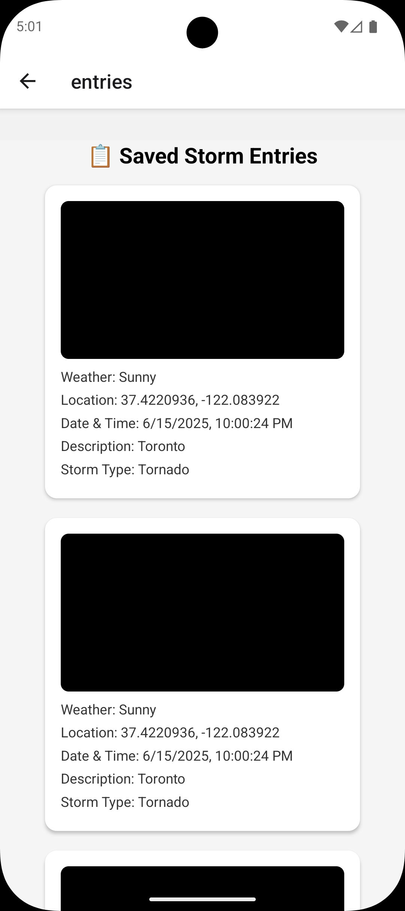

# Storm Chaser App

A React Native app for documenting and classifying storm events with photo, weather, location, and notes.  
This project was built as a portfolio/demo app to showcase mobile development skills, including API integration, local storage, and multi-screen navigation.

---

## Features

- 📸 Take and save storm photos with metadata
- 🌦️ Weather API integration (Open-Meteo)
- 📍 Automatic location capture
- 📝 Add notes and classify storm type
- 💾 Local data persistence (AsyncStorage)
- 📋 View and manage saved entries

---

## Tech Stack

- React Native (Expo)
- AsyncStorage
- Expo Location & Camera
- Open-Meteo API

---
## Demo Video

[▶️ Watch Demo Video](https://vimeo.com/1093872578?share=copy)


## Screenshots

<table align="center">
  <tr>
    <td align="center"><br/><b>Weather Info</b></td>
    <td align="center"><br/><b>Capture Storm</b></td>
    <td align="center"><br/><b>Storm Details</b></td>
    <td align="center"><br/><b>Success Popup</b></td>
    <td align="center"><br/><b>Saved Entries</b></td>
  </tr>
</table>

---

## Try Instantly

<div align="center">

<b>Scan this QR code with <a href="https://expo.dev/client" target="_blank">Expo Go</a> to try the app instantly on your device:</b>

<br/><br/>


</div>

---

## Get Started

1. **Install dependencies**
    ```bash
    npm install
    ```
2. **Start the app**
    ```bash
    npx expo start
    ```

You’ll find options to open the app in:
- development build
- Android emulator
- iOS simulator
- Expo Go (for quick testing)

You can start developing by editing the files inside the **app** directory. This project uses [file-based routing](https://docs.expo.dev/router/introduction/).

---

## Get a Fresh Project

When you're ready, run:

```bash
npm run reset-project
